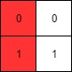

## [Leftmost Column with at Least a One](https://leetcode.com/explore/featured/card/30-day-leetcoding-challenge/530/week-3/3306/)

> #

*(This problem is an \**interactive problem**.)*

A binary matrix means that all elements are `0` or `1`. For each **individual** row of the matrix, this row is sorted in non-decreasing order.

Given a row-sorted binary matrix binaryMatrix, return leftmost column index(0-indexed) with at least a `1` in it. If such index doesn't exist, return `-1`.

**You can't access the Binary Matrix directly.**  You may only access the matrix using a `BinaryMatrix` interface:

- `BinaryMatrix.get(x, y)` returns the element of the matrix at index `(x, y)` (0-indexed).
- `BinaryMatrix.dimensions()` returns a list of 2 elements `[n, m]`, which means the matrix is `n * m`.

Submissions making more than `1000` calls to `BinaryMatrix.get` will be judged *Wrong Answer*.  Also, any solutions that attempt to circumvent the judge will result in disqualification.

For custom testing purposes you're given the binary matrix `mat` as input in the following four examples. You will not have access the binary matrix directly.

 

**Example 1:**

****

```
Input: mat = [[0,0],[1,1]]
Output: 0
```

**Example 2:**

****

```
Input: mat = [[0,0],[0,1]]
Output: 1
```

**Example 3:**

****

```
Input: mat = [[0,0],[0,0]]
Output: -1
```

**Example 4:**

****

```
Input: mat = [[0,0,0,1],[0,0,1,1],[0,1,1,1]]
Output: 1
```

 

**Constraints:**

- `1 <= mat.length, mat[i].length <= 100`
- `mat[i][j]` is either `0` or `1`.
- `mat[i]` is sorted in a non-decreasing way.


**Solutions:**

From the right-top element `[i, j]` of matrix, if `mat[i][j] == 1` move left (j--), or move down (i++). Until `mat[i][j]`'s left and all bottom are zero. Return j.

Actually, `BinaryMatrix.dimensions()` returns `[m, n]` which is more comprehensive than `[n, m]`.

Here is my solution class:

```c++
/**
 * // This is the BinaryMatrix's API interface.
 * // You should not implement it, or speculate about its implementation
 * class BinaryMatrix {
 *   public:
 *     int get(int x, int y);
 *     vector<int> dimensions();
 * };
 */

class Solution {
public:
    int leftMostColumnWithOne(BinaryMatrix &binaryMatrix) {
        vector<int> dimensions = binaryMatrix.dimensions();
        int m = dimensions[0], n = dimensions[1];
        int j = n - 1, i = 0;
        int finalI = 0, finalJ = n - 1;
        while (j >= 0 && i < m) {
            cout << "i = " << i << ", j = " << j << endl;
            if (binaryMatrix.get(i, j) == 1) {
                finalI = i;
                finalJ = j;
                j--;
            }
            else {
                i++;
            }
        }
        if (binaryMatrix.get(finalI, finalJ) == 0)
            return -1;
        else
            return finalJ;
    }
};
```

