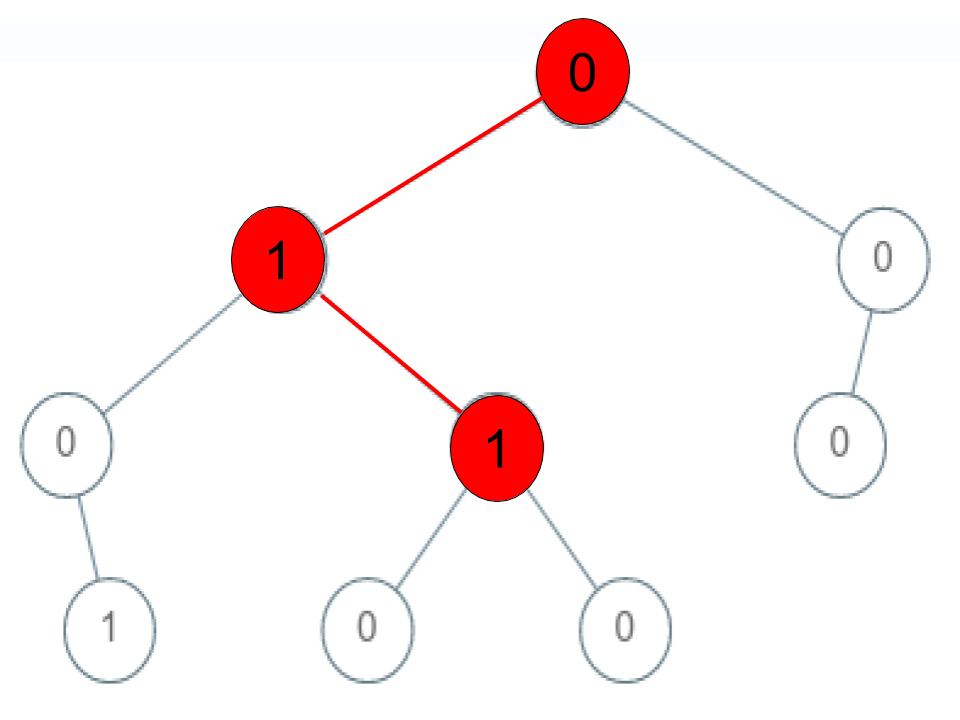

## [Check If a String Is a Valid Sequence from Root to Leaves Path in a Binary Tree](https://leetcode.com/explore/featured/card/30-day-leetcoding-challenge/532/week-5/3315/)

> #

Given a binary tree where each path going from the root to any leaf form a **valid sequence**, check if a given string is a **valid sequence** in such binary tree. 

We get the given string from the concatenation of an array of integers `arr` and the concatenation of all values of the nodes along a path results in a **sequence** in the given binary tree.

 

**Example 1:**

****

```
Input: root = [0,1,0,0,1,0,null,null,1,0,0], arr = [0,1,0,1]
Output: true
Explanation: 
The path 0 -> 1 -> 0 -> 1 is a valid sequence (green color in the figure). 
Other valid sequences are: 
0 -> 1 -> 1 -> 0 
0 -> 0 -> 0
```

**Example 2:**

****

```
Input: root = [0,1,0,0,1,0,null,null,1,0,0], arr = [0,0,1]
Output: false 
Explanation: The path 0 -> 0 -> 1 does not exist, therefore it is not even a sequence.
```

**Example 3:**

****

```
Input: root = [0,1,0,0,1,0,null,null,1,0,0], arr = [0,1,1]
Output: false
Explanation: The path 0 -> 1 -> 1 is a sequence, but it is not a valid sequence.
```

 

**Constraints:**

- `1 <= arr.length <= 5000`
- `0 <= arr[i] <= 9`
- Each node's value is between [0 - 9].


**Solutions:**

Use queue to traversal the whole binary tree. **Be cautious the `index` may be out of range.**

Here is my solution class:

```c++
/**
* Definition for a binary tree node.
* struct TreeNode {
*     int val;
*     TreeNode *left;
*     TreeNode *right;
*     TreeNode() : val(0), left(nullptr), right(nullptr) {}
*     TreeNode(int x) : val(x), left(nullptr), right(nullptr) {}
*     TreeNode(int x, TreeNode *left, TreeNode *right) : val(x), left(left), right(right) {}
* };
*/
class Solution {
public:
	bool isValidSequence(TreeNode* root, vector<int>& arr) {
		if (!root)
			return false;
		queue<pair<TreeNode*, int/*index*/>> que;
		que.push({ root,0 });
		while (!que.empty()) {
			TreeNode* curr = que.front().first;
			int index = que.front().second;
			if (index < arr.size() && curr->val == arr[index]) {
				if (index == arr.size() - 1 && !curr->left && !curr->right)
					return true;
				if (curr->left)
					que.push({ curr->left, index + 1 });
				if (curr->right)
					que.push({ curr->right,index + 1 });
			}
			que.pop();
		}
		return false;
	}
};
```

