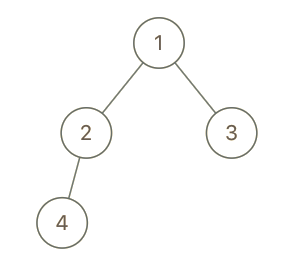

## 993. [Cousins in Binary Tree](https://leetcode.com/problems/cousins-in-binary-tree/)

> Easy

In a binary tree, the root node is at depth `0`, and children of each depth `k` node are at depth `k+1`.

Two nodes of a binary tree are *cousins* if they have the same depth, but have **different parents**.

We are given the `root` of a binary tree with unique values, and the values `x` and `y` of two different nodes in the tree.

Return `true` if and only if the nodes corresponding to the values `x` and `y` are cousins.

 

**Example 1:**

```
Input: root = [1,2,3,4], x = 4, y = 3
Output: false
```

**Example 2:**

```
Input: root = [1,2,3,null,4,null,5], x = 5, y = 4
Output: true
```

**Example 3:**

****

```
Input: root = [1,2,3,null,4], x = 2, y = 3
Output: false
```

 

**Note:**

1. The number of nodes in the tree will be between `2` and `100`.
2. Each node has a unique integer value from `1` to `100`.


**Solutions:**

Recursion. Return the depth of `x` and `y`, and in the meantime, store parents of `x` and `y`. Initialize `parentX = parentY` so that in case we cannot find both `x` and `y`, the answer is `false`, too.

Here is my solution class:

```c++
/**
* Definition for a binary tree node.
* struct TreeNode {
*     int val;
*     TreeNode *left;
*     TreeNode *right;
*     TreeNode() : val(0), left(nullptr), right(nullptr) {}
*     TreeNode(int x) : val(x), left(nullptr), right(nullptr) {}
*     TreeNode(int x, TreeNode *left, TreeNode *right) : val(x), left(left), right(right) {}
* };
*/
class Solution {
public:
	bool isCousins(TreeNode* root, int x, int y) {
		if (!root)
			return false;
		int parentX = 0, parentY = 0;
		int depthX = isCousinsCore(root, x, parentX);
		int depthY = isCousinsCore(root, y, parentY);
		if (depthX == depthY && parentX != parentY)
			return true;
		else
			return false;
	}

	int isCousinsCore(TreeNode* root, int x, int& parent) {
		if (!root)
			return -1;
		if (root->val == x)
			return 0;
		int left = isCousinsCore(root->left, x, parent);
		int right = isCousinsCore(root->right, x, parent);
		if (left == 0 || right == 0) {
			parent = root->val;
			return 1;
		}
		else if (left != -1)
			return left + 1;
		else if (right != -1)
			return right + 1;
		else
			return -1;
	}
};
```

